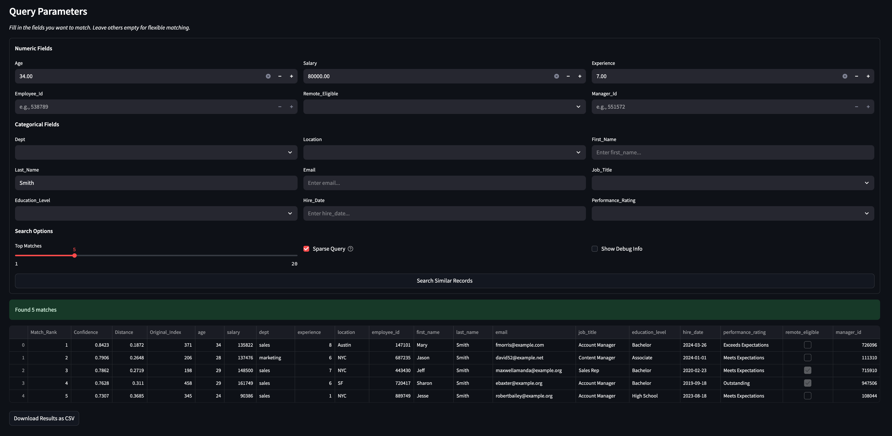

# Hopfield Table Memory

An interactive, memory-efficient similarity engine for structured data, built on Hopfield networks with a Streamlit UI.

## Overview

Transform any pandas DataFrame into an associative memory that supports:

- **Sparse Querying**: Match using only the fields you provide
- **Similarity Search**: Ranked by distance and confidence score
- **Mixed Data Support**: Works with both numeric and categorical features
- **Interactive UI**: Powered by Streamlit with sliders, dropdowns, and debug tools

## Quick Start

### Install Requirements

```bash
pip install torch pandas scikit-learn matplotlib streamlit git+https://github.com/ml-jku/hopfield-layers
```

### 2. Run the App

```bash
streamlit run query.py
```

### Example



## How It Works

Each row in a DataFrame is converted to a vector:

* **Numeric** features are scaled with `MinMaxScaler`
* **Categorical** features are one-hot encoded
* The resulting vectors are stored in a Hopfield layer for pattern association and comparison

During a query:

* Only the specified fields are encoded and used for distance calculation (sparse mode)
* Top-N matches are ranked by Euclidean distance
* Confidence = `1 / (1 + distance)`

## Files

* `hopfield_table.py` — Core class with encoding, querying, and memory expansion
* `query.py` — Streamlit interface for querying and debugging

## Features

* Confidence scores and raw distances per result
* Add new rows dynamically with `add_patterns()`
* Visualize internal behavior via debug mode
* Built-in example dataset with `age`, `salary`, `dept`, `experience`, and `location`
